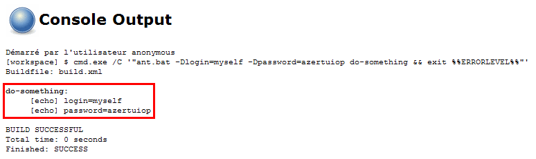
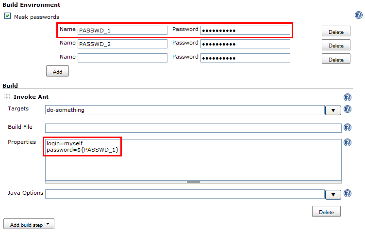
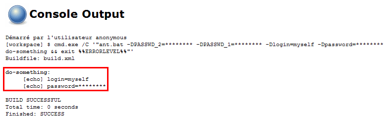
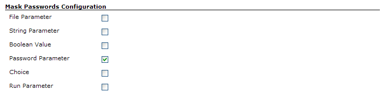

# Mask Passwords plugin for Jenkins

This plugin allows masking passwords that may appear in the console.

## About this plugin

This plugin allows masking passwords that may appear in the console,
including the ones defined as build parameters.
This often happens, for example, when you use build steps which *can't* handle passwords properly.
Take a look at the following example.

### Before

Consider you're using an **Invoke Ant** build step to run an Ant target.
This target requires a password to achieve its goal.
You would end up having a job configuration like this:


Of course, you could have created a variable to store the password and use this variable in the build step configuration so that it doesn't appear as plain text.
But you would still end with a console output like this:



### After

When activating the **Mask passwords** option in a job, the builds' **Password Parameters**
(or any other type of build parameters selected for masking in **Manage Jenkins** \> **Configure System**) are automatically masked from the console.
Furthermore, you can also safely define a list of static passwords to be masked
(you can also define a list of static password shared by all jobs in Jenkins' main configuration screen).
As such, the passwords don't appear anymore as plain text in the job configuration
(plus it is ciphered in the job configuration file):



Once done, new builds will have the passwords masked from the console output:



## Pipeline Support

The [declarative directive generator](https://www.jenkins.io/doc/book/pipeline/getting-started/#directive-generator) allows the Pipeline author to interactively define the parameters of a Pipeline.

This plugin provides the `nonStoredPassword` parameter type for Jenkins Pipelines, allowing you to define password parameters that are only provided at runtime and not stored in the job configuration.
This is ideal for sensitive credentials that should not persist in your pipeline code.

The plugin also provides the [`maskPasswords` block](https://www.jenkins.io/doc/pipeline/steps/mask-passwords/) that can wrap sections of Pipeline code where the value of a password should be masked in build logs.

**Declarative Pipeline Example:**
```groovy
pipeline {
    agent none
    parameters {
        nonStoredPassword(name: 'MY_PASSWORD', description: 'Database password')
    }
    stages {
        stage('Deploy') {
            steps {
                maskPasswords(varPasswordPairs: [[var: 'MY_PASSWORD']], varMaskRegexes: []) {
                    echo "Masked password parameter ${MY_PASSWORD}"
                }
                echo "Unmasked password parameter ${MY_PASSWORD}"
            }
        }
    }
}
```

The [Pipeline Syntax Snippet Generator](https://www.jenkins.io/redirect/pipeline-snippet-generator) guides the user to define parameters of a scripted Pipeline as properties.

The plugin also provides the [`maskPasswords` block](https://www.jenkins.io/doc/pipeline/steps/mask-passwords/) that can wrap sections of Pipeline code where the value of a password should be masked in build logs.

**Scripted Pipeline Example:**
```groovy
node {
    properties([parameters([nonStoredPassword(name: 'API_KEY', description: 'API key')])])
    stage('Build') {
        maskPasswords(varPasswordPairs: [[var: 'API_KEY']], varMaskRegexes: []) {
            echo "Masked password parameter ${API_KEY}"
        }
        echo "Unmasked password parameter ${API_KEY}"
    }
}
```

## User guide

First, go to Jenkins' main configuration screen (**Manage Jenkins** \> **Configure System**) and select,
in the **Mask Passwords - Configuration** section, which kind of build parameters have to be automatically masked from the console output:



Notice that, as of version 2.7, you can also define global passwords (defined as pairs of name/password) that can be accessed across all jobs.

Then, for a specific job, activate the **Mask passwords** option in the **Build Environment** section to mask passwords from the console:

1.  All the password parameters defined for the job will be automatically hidden.
2.  For each other kind of password (that is, static ones) that may appear in the console output,
    add an entry (by clicking on the **Add** button) and set the **Password** field.
    You may additionally set the **Name** field.
    If you do so, the password will then be available as a standard variable.
    It is then possible to refer to this password using this variable rather than keying it in a field which is not ciphered.
    Take a look at the screenshots above for an example.

## Release Notes

* See [GitHub Releases](https://github.com/jenkinsci/mask-passwords-plugin/releases) for recent releases
* See the [Changelog archive](./docs/CHANGELOG.old.md) for 2.12.0 and before
